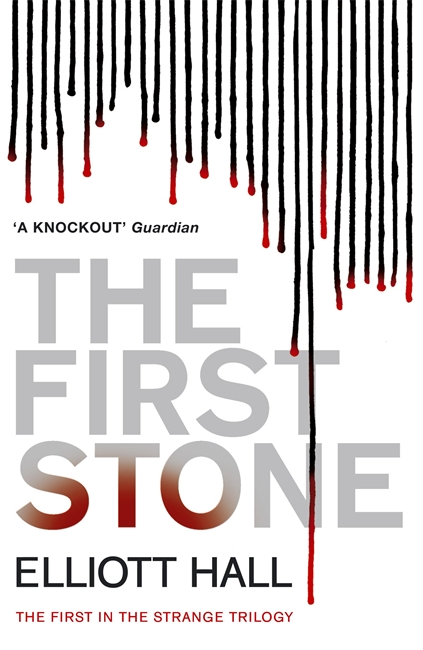
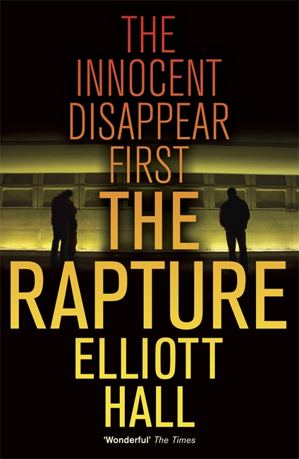

## The First Stone

> *Private eye Felix Strange doesn’t work homicide cases. He saw enough dead bodies fighting in Iran, a war that left him with a crippling disease that has   no name and no cure. So when Strange is summoned to a Manhattan hotel room to investigate the dead body of America’s most-loved preacher, he’d rather not get involved.*

## The Rapture

> *Isaac Taylor isn’t missing. According to government records, he never existed.
    PI Felix Strange isn’t convinced, not least because Isaac is an old army buddy.
    Strange soon discovers Isaac isn’t the only one missing. All over the country,
    young and old, men and women, the good and the trying-to-be, are disappearing
    – quite literally without a trace.*

## The Children's Crusade
>  *Felix Strange is working his last case.  Across the American South, the militant Sons of David are on the rise. Their leader, the prophet Joshua, is leading a teenage rebellion, promising a new world to replace the sinful old. Strange’s mission, should he choose to accept it, is to assassinate Joshua.  The problem?
    He’s twelve years old.*